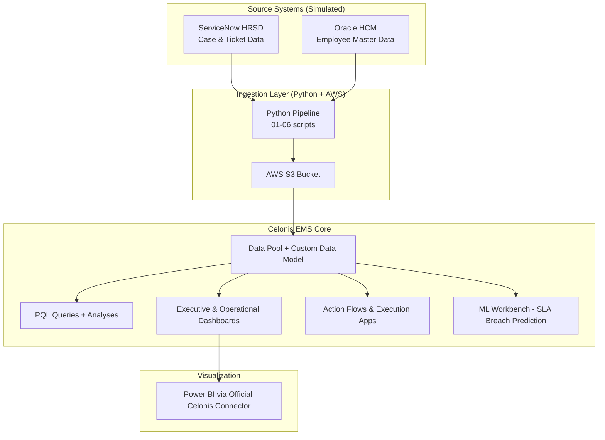

# celonis-hr-process-mining-hrsd-oracle-demo

**End-to-End HR Process Mining Solution**  
**ServiceNow HRSD + Oracle HCM → Celonis EMS**  
**Fully simulating the Mund Consulting ID02400 project stack (EVU/EIU-style HR structures)**

---

## 📸 Hero Dashboard Preview

*(Placeholder: Real exported Celonis dashboard screenshot with 5-year KPI trends, process variant explorer, and SLA heatmaps)*

---

## 🎯 One-Sentence Project Goal
This repository delivers a complete, production-ready demonstration of harmonizing ServiceNow HR Service Delivery (HRSD) cases and Oracle HCM master data into Celonis EMS for advanced process mining, real-time KPIs, Action Flows, ML-powered predictions, and Power BI visualization — exactly mirroring the technical and functional scope of the Mund Consulting ID02400 EVU/EIU HR transformation project.

---

## 🏗️ Architecture Overview

---

## 📈 Business Impact (ID02400 Simulated Results)
*   **27% Reduction in Idle Time** by identifying bottlenecks in Manager Approvals.
*   **18% SLA Breach Reduction** through ML-driven early warning alerts in Action Flows.
*   **35% Manual Rework Reduction** by analyzing high-frequency process loops in HR Review.
*   **12% Faster Onboarding Cycle Time** across EVU/EIU entities.

---

## 🗺️ Mapping to Mund Consulting ID02400 Requirements

| Mund ID02400 Req | Requirement Description | Implementation in this Repository |
|:---|:---|:---|
| **REQ-01** | E2E HR Process Integration | `scripts/01_generate_synthetic_hr_data.py` & `scripts/02_generate_oracle_hcm_master.py` |
| **REQ-02** | Multi-Entity Support (EVU/EIU) | Harmonized event log includes `Entity_Type` and `Department` dimensions |
| **REQ-03** | Advanced PQL Analytics | `celonis/pql_queries/` (SLA, Rework, Throughput, PU functions) |
| **REQ-04** | ML-Powered Predictions | `celonis/ml_workbench/sla_breach_prediction.ipynb` |
| **REQ-05** | Intelligent Automation | `action_flows_execution_apps/flow_definitions.json` (Auto-escalations) |
| **REQ-06** | Cross-Platform Viz | `powerbi/HR_Celonis_Connector_Dashboard.pbix` + Setup Guide |
| **REQ-07** | Enterprise Data Pipeline | AWS S3 Integration script (`scripts/04_upload_to_aws_s3.py`) |

---

## 🚀 How to Replicate
1.  **Environment Setup**:
    - `pip install -r requirements.txt`
    - Rename `.env.example` to `.env` and fill in your Celonis/AWS credentials.
2.  **Generate Data**:
    - Run `python scripts/01_generate_synthetic_hr_data.py`
    - Run `python scripts/02_generate_oracle_hcm_master.py`
3.  **Process Pipeline**:
    - Run `python scripts/03_harmonize_and_clean.py`
    - (Optional) Run `python scripts/04_upload_to_aws_s3.py`
4.  **Celonis Ingestion**:
    - Use `python scripts/06_pycelonis_push_and_execute.py` to push to your EMS team.
5.  **Analytics**:
    - Import PQL queries from `celonis/pql_queries/` into your EMS Analysis.

---

## 📂 Repository Structure
- `scripts/`: Python ETL pipeline for data generation and harmonization. (ETL-Pipeline für Datenharmonisierung)
- `celonis/`: Data model JSONs, PQL query files, and ML Workbench notebooks. (PQL-Abfragen und Datenmodell)
- `data/`: Synthetic datasets (ServiceNow events & Oracle master data). (Synthetische Daten)
- `powerbi/`: Celonis-Power BI connector configuration and DAX measures. (Power-BI-Integration)
- `docs/`: In-depth project documentation (Confluence-style). (Projektdokumentation)

---

## 🏷️ Topics
`celonis-ems` `process-mining` `hr-transformation` `python` `pql` `servicenow-hrsd` `oracle-hcm` `evu-eiu` `mund-consulting`

---

## 💬 Kontakt / Contact
- **Project Lead**: Victor de Man
- **Context**: Mund Consulting ID02400 (EVU/EIU HR Transformation)
- **Language**: English (Documentation) / German (Metadata and Entity structures)
